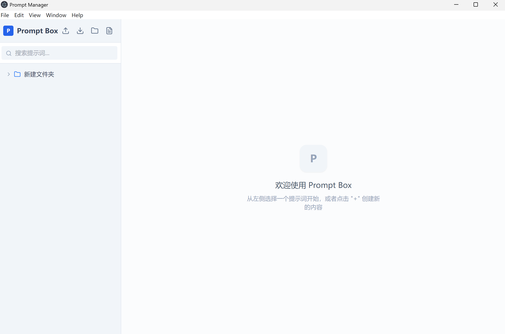

# Prompt Box

<div align="center">


一个简洁高效的 AI 提示词管理工具，帮助你更好地组织和管理提示词

[功能特性](#功能特性) • [快速开始](#快速开始) • [使用指南](#使用指南) • [开发](#开发)

</div>

---

## 📸 预览



## ✨ 功能特性

### 核心功能

- 📁 **树形结构管理** - 支持无限层级的文件夹嵌套，像文件管理器一样组织你的提示词
- ✏️ **灵活重命名** - 双击重命名、按钮重命名、详情面板重命名，多种方式随心选择
- 🔍 **全文搜索** - 快速搜索提示词名称和内容
- 🎯 **拖拽移动** - 拖拽文件和文件夹到任意位置，轻松重组结构
- 📋 **一键复制** - 快速复制提示词内容到剪贴板

### 高级功能

- 🔧 **模板变量** - 使用 `{{变量名}}` 语法定义变量，复制时自动替换
- 💾 **数据持久化** - 基于 SQLite 数据库，数据安全可靠
- 📤 **导入导出** - 支持 JSON 格式导入导出，轻松备份和分享
- 🎨 **现代化界面** - 基于 Tailwind CSS 的精美 UI 设计
- ⚡ **高性能** - 采用 Electron 框架，原生应用般的流畅体验

## 🚀 快速开始

### 下载安装

#### Windows

1. 前往 [Releases](https://github.com/WhiskerSage/Prompt-Box/releases) 页面下载最新版本
2. 下载 `Prompt Manager Setup 0.0.0.exe`
3. 双击安装包，按提示完成安装

#### 从源码构建

```bash
# 克隆项目
git clone https://github.com/WhiskerSage/Prompt-Box.git
cd Prompt-Box

# 安装依赖
npm install

# 开发模式运行
npm run dev

# 构建应用
npm run build
```

## 📖 使用指南

### 基本操作

#### 创建提示词和文件夹

- 点击顶部工具栏的文件夹图标创建根文件夹
- 点击文件图标创建根提示词
- 鼠标悬停在文件夹上，点击 `+` 按钮在文件夹内创建子项

#### 重命名

**方式一：树形列表**
- 双击文件/文件夹名称进入编辑模式
- 或鼠标悬停后点击铅笔图标
- 按 Enter 保存，Escape 取消

**方式二：详情面板**
- 选中提示词后，在右侧顶部直接编辑名称
- 自动保存

#### 移动文件

- 拖拽文件或文件夹到目标文件夹
- 支持拖拽到根目录（空白区域）

#### 删除

- 鼠标悬停在项目上，点击垃圾桶图标
- 删除文件夹会同时删除其所有子项

### 高级功能

#### 使用模板变量

1. 在提示词内容中使用 `{{变量名}}` 语法：

```
你是一个 {{角色}}，擅长 {{技能}}。
请帮我 {{任务}}。
```

2. 编辑时会自动识别变量并显示输入框
3. 填写变量值后点击"复制内容"，会自动替换变量

#### 导入导出

**导出数据：**
- 点击顶部下载图标
- 自动下载 JSON 格式备份文件

**导入数据：**
- 点击顶部上传图标
- 选择之前导出的 JSON 文件

#### 搜索

- 在搜索框输入关键词
- 支持搜索名称和内容
- 点击搜索结果直接跳转

## 🛠️ 技术栈

### 前端

- **框架：** React 18.3.1
- **语言：** TypeScript 5.6.2
- **状态管理：** Zustand
- **样式：** Tailwind CSS
- **图标：** Lucide React
- **构建工具：** Vite

### 后端

- **桌面框架：** Electron 28.3.3
- **数据库：** Better-SQLite3
- **进程通信：** IPC (Inter-Process Communication)

### 开发工具

- **打包：** electron-builder
- **代码规范：** ESLint
- **工具函数：** Lodash

## 💻 开发

### 环境要求

- Node.js >= 16
- npm >= 7

### 开发模式

```bash
# 安装依赖
npm install

# 启动开发服务器
npm run dev
```

### 项目结构

```
prompt-box/
├── src/                    # React 前端代码
│   ├── App.tsx            # 主组件
│   ├── store.ts           # Zustand 状态管理
│   ├── types.ts           # TypeScript 类型定义
│   └── index.css          # 样式文件
├── electron/              # Electron 主进程代码
│   ├── main.ts           # 主进程入口
│   ├── preload.ts        # 预加载脚本
│   └── database.ts       # 数据库操作
├── public/               # 静态资源
└── package.json          # 项目配置
```

### 构建发布

```bash
# 构建生产版本
npm run build

# 构建产物在 release/ 目录
```

## 🗄️ 数据存储

数据库文件位置：
- **Windows:** `%APPDATA%/prompt-manager/prompts.db`
- **macOS:** `~/Library/Application Support/prompt-manager/prompts.db`
- **Linux:** `~/.config/prompt-manager/prompts.db`

### 数据库结构

```sql
CREATE TABLE prompts (
  id TEXT PRIMARY KEY,
  type TEXT NOT NULL,           -- 'folder' | 'prompt'
  name TEXT NOT NULL,
  content TEXT,
  parentId TEXT,
  createdAt TEXT NOT NULL,
  updatedAt TEXT NOT NULL
);
```

## 🤝 贡献

欢迎贡献代码、报告问题或提出建议！

1. Fork 本仓库
2. 创建特性分支 (`git checkout -b feature/AmazingFeature`)
3. 提交更改 (`git commit -m 'Add some AmazingFeature'`)
4. 推送到分支 (`git push origin feature/AmazingFeature`)
5. 开启 Pull Request

## 📝 待办事项

- [ ] 添加右键菜单
- [ ] 支持快捷键操作 (F2 重命名、Delete 删除等)
- [ ] 支持多主题切换
- [ ] 支持标签系统
- [ ] 支持提示词收藏
- [ ] 支持提示词版本历史
- [ ] 支持云端同步

## ❓ 常见问题

**Q: 数据存储在哪里？**
A: 数据存储在本地 SQLite 数据库中，位置见 [数据存储](#数据存储) 部分。

**Q: 如何备份数据？**
A: 点击导出按钮下载 JSON 备份文件，或直接复制数据库文件。

**Q: 支持哪些操作系统？**
A: 目前主要支持 Windows，macOS 和 Linux 理论上也可以运行，但未经充分测试。

**Q: 如何卸载？**
A: Windows 系统在控制面板中卸载，数据库文件需手动删除。

## 📄 许可证

本项目采用 MIT 许可证 - 详见 [LICENSE](LICENSE) 文件

## 🙏 致谢

- [Electron](https://www.electronjs.org/) - 跨平台桌面应用框架
- [React](https://react.dev/) - 用户界面库
- [Tailwind CSS](https://tailwindcss.com/) - 实用优先的 CSS 框架
- [Lucide](https://lucide.dev/) - 美观的图标库

---

<div align="center">

**如果这个项目对你有帮助，请给一个 ⭐️ Star！**

Made with ❤️ by [WhiskerSage](https://github.com/WhiskerSage)

</div>
